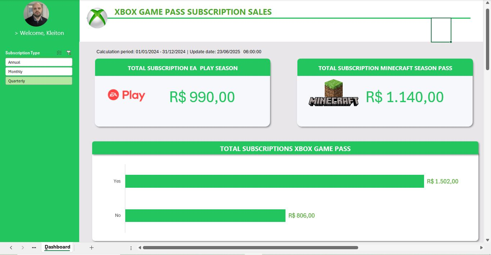
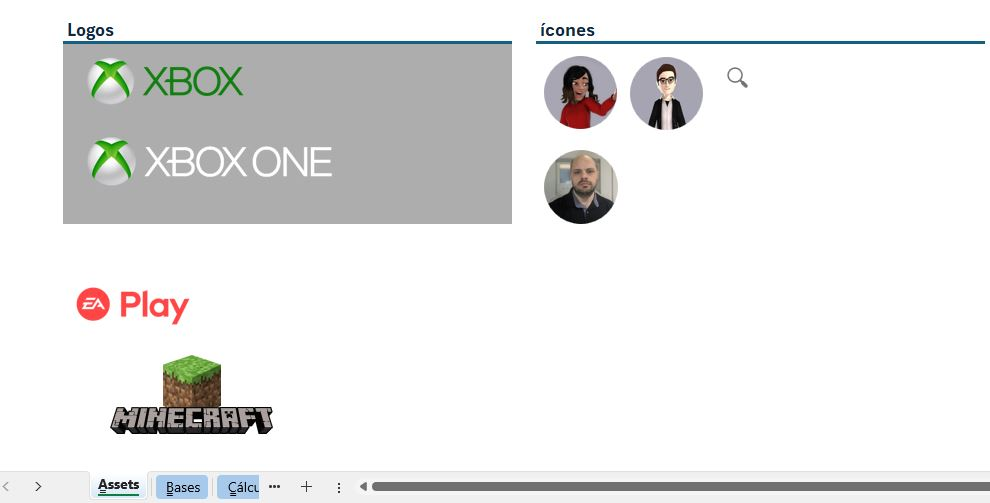
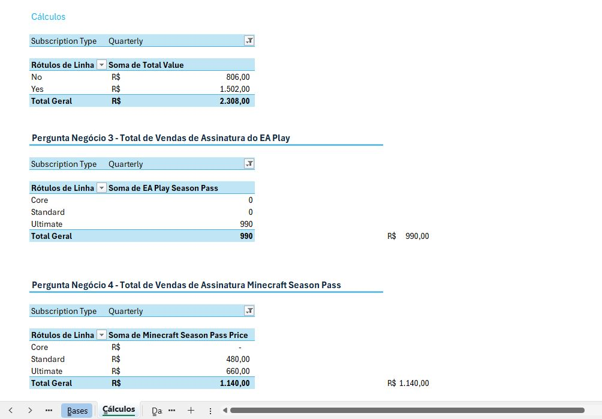

# 🎮 Dashboard de Vendas do Xbox

Olá! Esse é um projeto que desenvolvi como parte de um desafio da plataforma DIO (Digital Innovation One). O objetivo era aplicar na prática o que venho estudando sobre Excel, visualização de dados e criação de dashboards — tudo com foco em melhorar minhas habilidades e me preparar para o mercado de trabalho como analista de dados júnior.

---

## 📝 Sobre o Projeto

Neste projeto, trabalhei com uma base de dados fictícia de vendas de produtos Xbox. A proposta era organizar os dados, tratar informações, construir visualizações claras e montar um dashboard interativo no Excel, que pudesse ajudar na tomada de decisões.

---

## 🎯 Objetivos do Dashboard

- Entender o desempenho de vendas por produto
- Visualizar as regiões com maior volume de vendas
- Explorar tendências ao longo do tempo
- Praticar a criação de indicadores e gráficos

---

## 🖼️ Imagens do Projeto

### 📊 Visão geral do dashboard

### 📌 Tela do Excel com segmentações

### 🧮 Cálculos e estrutura de dados

---

## 📁 Arquivos Disponíveis

- `dashboard_xbox_finalizado.xlsx`: arquivo com o dashboard completo
- Pasta `imagens/`: capturas de tela do projeto

---

## 🧰 Ferramentas e Técnicas Utilizadas

- **Excel 365**
- Power Query (para organizar os dados)
- Tabelas e Gráficos Dinâmicos
- Segmentações e filtros
- Fórmulas
